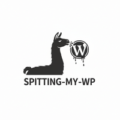

# spitting-my-wp 1.0.0



## Description
Vibe coding, not a serious project what so ever. The aim is to practive my `bash scripting` skill. Basically, I wannted to automate the process of obtaining RSS from some local news websites (mostly based on Wordpress) and re-write the article in short/to-the-point message that will helps reader easy get the message it wanted to deliver, by AI power.


### Notes
```bash
for i in $(cat ./idberita.txt);do curl -q -s "https://jubi.id/wp-json/wp/v2/posts/$i" -o ./tmps/berita-$i.json;done
```
